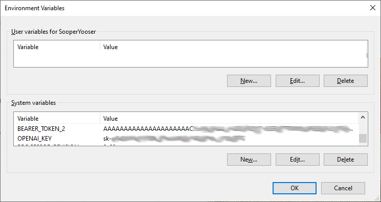
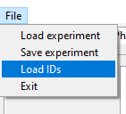

Explorer Apps
====================================

There are six(!) applications in this project, _KeywordExplorer_, _TweetsCountExplorer_, _TweetDownloader_,  _WikiPageviewExplorer_, _TweetEmbedExplorer_, and _ModelExplorer_. The latest stable version can be installed with pip:

    pip install keyword-explorer

A brief overview of each can be reached using the links below. 

[**KeywordExplorer**](./markup/KeywordExplorer.md) is a Python desktop app that lets you use the GPT-3 to search for keywords and Twitter to see if those keywords are any good.

[**TweetCountsExplorer**](./markup/TweetsCountExplorer.md) is a Python desktop app that lets you explore the quantity of tweets containing keywords over days, weeks or months.

[**TweetDownloader**](./markup/TweetDownloader.md) is a Python desktop app that lets you select and download tweets containing keywords into a database. The number of Tweets can be adjusted so that they are the same for each day or proportional. Users can apply daily and overall limits for each keyword corpora.

[**WikiPageviewExplorer**](./markup/WikiPageviewExplorer.md) is a Python desktop app that lets you explore keywords that appear as articles in the Wikipedia, and chart their relative page views.

[**TweetEmbedExplorer**](./markup/TweetEmbedExplorer.md) is a Python desktop app for analyzing, filtering, and augmenting tweet information. Augmented information can them be used to create a train/test corpus for finetuning language models such as the GPT-2,

[**ModelExplorer**](./markup/ModelExplorer.md) is a Python desktop app that lets a user interact with a finetuned GPT-2 model trained using EmbeddingExplorer

## Before Using! <span id = "before-using"/>

Most of these apps **require** that you have an OpenAI account and/or a Twitter developer account:

* _KeywordExplorer_ requires a Twitter and OpenAI account
* _TweetCountExplorer_ requires a Twitter developer account
* _WikiPageviewExplorer_ uses the wikipedia API (pip install wikipedia), and requires a user agent
* _TweetDownloader_ requres additional elements such as a database, which will be descussed in its section but not here. 
* _TweetEmbedExplorer_ requires a Twitter account, OpenAI account, and a MariaBD/MySQl database
* _ModelExplorer_ uses the HuggingFace _transformers_ API (pip install transformers), and a MariaDB/Mysql database
* _ModelExplorer_ requires GPT-2 models trained on corpora generated by _TweetEmbedExplorer_. To train a model, follow these steps: [How to train a model](./markup/model_train.md)

The following links are very helpful:

- OpenAI: https://openai.com/api/
- https://beta.openai.com/docs/introduction
- Twitter: https://developer.twitter.com/en
- https://developer.twitter.com/en/docs/twitter-api/getting-started/getting-access-to-the-twitter-api
- https://developer.twitter.com/en/docs/authentication/guides/v2-authentication-mapping
- HuggingFace: https://huggingface.co/docs/transformers/installation

In each case you'll have to get an ID and set it as an environment variable. The names must be OPENAI_KEY for your GPT-3 account and BEARER_TOKEN_2 for your Twitter account, as shown below for a Windows environment:

>

If you don't have permissions to set up environment variables or just don't want to, you can set up a json file and load that instead:

```
{
  "BEARER_TOKEN_2": "AAAAAAAAAAAAAAAAAAAAAC-----------------------",
  "OPENAI_KEY": "sk-s------------------------------------",
  "USER_AGENT": "xyz@xyz.com",
}
```

In this case, BEARER_TOKEN_2 id for the Twitter V2 account, OPENAI_KEY is for the GPT-3, and USER_AGENT is for accessing the Wikipedia. 

To load the file click on the "File" menu and select "Load IDs". Then navigate to the json file and select it. After the ids are loaded, any application that depends on them will run. If you try using an app that doesn't have an active ID, it will complain.




Alternately you can create a `.env` file in the folder from which you are running the apps or a parent folder thereof.
An example of this file is provided as `.env_example`.  

To use this method copy `.env_example` to `.env`,  enter your keys and save the file.  

This file uses [dotenv](https://pypi.org/project/python-dotenv/) to automatically search for and environment variables and load them.
`.env` is ignored by git as to make sure it is not committed.

```
DATABASE_USER=root
DATABASE_PASSWORD=password
DATABASE_HOST=localhost
DATABASE_SSL_CA=/home/username/.ssl/DigiCertGlobalRootG2.crt.pem
OPENAI_KEY=AAAAAAAAAAAAAAAAAAAAAC-----------------------
BEARER_TOKEN_2=AAAAAAAAAAAAAAAAAAAAAC-----------------------
USER_AGENT=xyz@xyz.com
```

Default values are used if an environment variable is omitted.

`DATABASE_SSL_CA` is only required if you are connecting to a non-local database via ssl.  It is the path to the file that contains a PEM-formatted CA certificate.
By example, if you are using an Azure MySQL database the .pem file can be obtained [here](https://learn.microsoft.com/en-us/azure/mysql/single-server/how-to-configure-ssl).
Sometimes the Root CA changes, as happened recently with Azure MySQL.  The new certificates can be found [here](https://learn.microsoft.com/en-us/azure/mysql/single-server/concepts-certificate-rotation).

## MySQL Database Setup

1. Create a .my.cnf file in your home directory:

```{bash}
touch ~/.my.cnf
```

2. Open the .my.cnf file and paste the contents of .my.cnf_example into it.

3. Modify the values in .my.cnf to match your MySQL configuration.

Set the correct file permissions:

```{bash}
chmod 600 ~/.my.cnf
```

4. Verify the setup by running mysql without specifying user and password.

```{bash}
make show-databases
```

5. Create the databases.

```{bash}
make create-databases
```

## make commands explained

|make|description|
|---|---|
|help             |This help|
|clean            |Removes build artifacts|
|clean-all        |Remove the virtual environment and build artifacts|
|venv             |Create/update project's virtual enviornment. To activate, run: source activate.sh|
|test             |Run unit tests|
|dist             |Create python package and run unit tests|
|publish          |Create/publish python package to test pypi repo|
|show-databases   |show existing databases (also tests database connection)|
|create-databases |create databases|
|drop-databases   |drop databases|

You should be good to use the apps!

