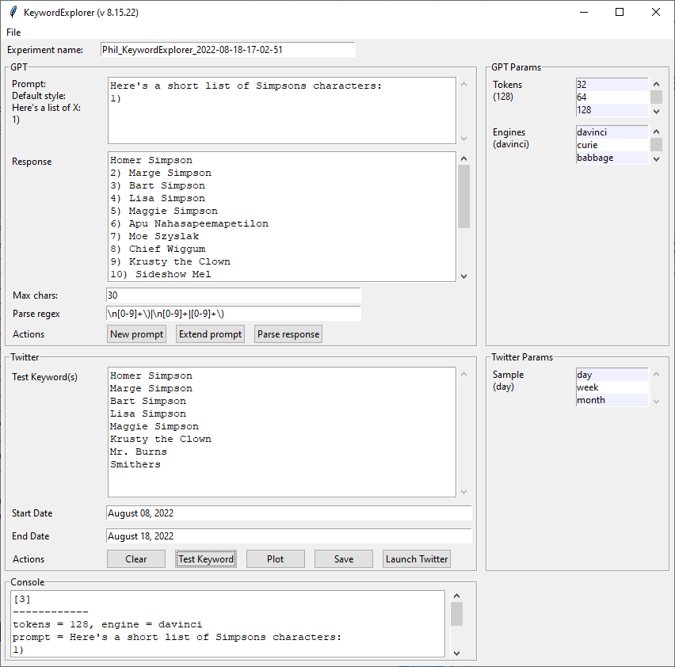
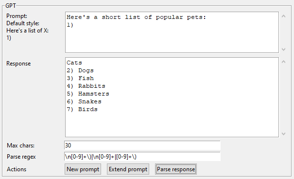
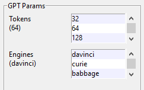
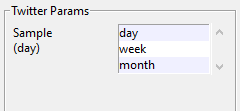

## KeywordExplorer

KewordExplorer is a Python desktop app that lets you use the GPT-3 to search for keywords and Twitter to see if those keywords are any good. Below is an example of the running app:

And this is an example of the Twitter results:

## How to use

Using the tool is pretty straightforward. That being said, it's possible to break it. If you are running it in the console, then you will get additional information on the command line that might help you figure out things. Most often, it is a poorly-formed keyword that gets sent off to Twitter. Also, setting up your twitter account properly is tricky, so make sure that you have that working for counts. See

https://developer.twitter.com/en/docs/twitter-api/tweets/counts/introduction

if you run into trouble.

The screen is divided into 5 regions:
- GPT
- GPT Params
- Twitter
- Twitter Params
- Console

### GPT

This is where you interact with the GPT-3 directly. You might want to use the playground a bit to get the hang of writing prompts. The app starts up with the default prompt

_Here's a short list of popular pets_\
_1)_

The carriage return with the 1) prompts the GPT to return a numbered list. Most of the time. The GPT-3 has a value called _temperature_ which adds some randomness to the prompt response. In this app, the value is fixed at 0.4 on a scale from 0.0 to 1.0.

Clicking on 'New Prompt' will send that prompt to the GPT-3. You'll see that it was sent, along with the selected engine and the number of tokens in the *Console* window. If you want to continue prompting, then 'Extend Prompt', which will add the results to the initial prompt. You may have to edit the text a bit, since the GPT can stop in mid-word while generating a response.

Clicking on 'Parse Response' will apply the regex in the 'Parse Regex' field to the resonse text and place the parsed results in the 'Test Keyords' area in the Twitter section. You can edit or try new regexes if you have a different form of output. I highly recommend (https://regex101.com) as a place to test out regexes on text. You can copy the text from the Response field into their playground.

### GPT Params

### Twitter

### Twitter Params

