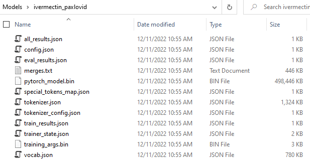
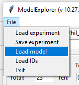

# ModelExplorer

_ModelExplorer_ is a standalone Python application that lets a user interact with a finetuned GPT-2 model trained using EmbeddingExplorer


## Before Starting
_ModelExplorer_ requres a MySQL-compatable database. My favorite is MariaDB, wich comes with the [XAMPP stack](https://www.apachefriends.org/). The code uses the LOCAL_ROOT_MYSQL system variable, which you can set up in Windows by using the [Environment Variables](https://docs.oracle.com/en/database/oracle/machine-learning/oml4r/1.5.1/oread/creating-and-modifying-environment-variables-on-windows.html) control panel as shown below:


The schema for the database is in the **data** directory. The database must be named **gpt_experiments**. The easiest way that I know to create the database is to open a console window in the directory with the sql file, then access the database (e.g. <span style="font-family:Courier;">mysql -u root -pmy_sql_password123</span>). At the sql prompt, type the following

```
MariaDB [(none)]> create database gpt_experiments;
MariaDB [(none)]> use gpt_experiments;
MariaDB [gpt_experiments]> source gpt_experiments_schema.sql;
MariaDB [gpt_experiments]> describe gpt_experiments;
+---------------------------+
| Tables_in_gpt_experiments |
+---------------------------+
| combined                  |
| model_combined            |
| table_experiment          |
| table_output              |
| table_text                |
| table_text_data           |
| test_view                 |
+---------------------------+
7 rows in set (0.001 sec)
```
### GPT-2 Models
_ModelExplorer uses Huggingface GPT-2 models fine-tuned to create tweets wrapped in meta information. The creation of the corpora is described in [**TweetEmbedExplorer**](../markup/TweetEmbedExplorer.md). Briefly, you need to have a test and train file that has text that looks like this: 

        [[text: RT @Andygetout: Sehr geehrter @Karl_Lauterbach,gestern und heute musste ich mit Schrecken feststellen, wie und warum Paxlovid NICHT bei d… || created: 2022-09-04 07:10:25 || location: Kaiserslautern, Germany || probability: twenty]]
        [[text: RT @axios: There's growing concern about the link between Pfizer's antiviral pill and COVID rebound, in which patients test positive or hav… || created: 2022-09-03 02:40:34 || location: Bendigo, Victoria. Australia || probability: thirty]]

To train a model, follow these directions: [How to train a model](../markup/model_train.md).

At this point the app should be ready to use.

## How to use

Using the tool is pretty straightforward. That being said, it's possible to break it. If you are running it in the console, then you will get additional information on the command line that might help you figure out things. 

This tool *generates* text. The type of text is influenced on its training data. If you have fed it a diet of posts consisting of right-wing hate speech, it will generate more of that. If you training posts about kittens and puppies and rainbows, it will generate more of that! What's really interesting about these models is that they are capable of *accurately inferring* about data that is not in the training data. For example, when we trained a model on Yelp reviews but left out anything with the phrase "vegetarian options", the trained model was able to accurately generate reviews using "vegetarian options" as the prompt that had the same sentiment ratios as the reviews in the held-out data. More detail is in the paper "[Polling Latent Opinions: A Method for Computational Sociolinguistics Using Transformer Language Models](https://arxiv.org/abs/2204.07483)"

## Loading the Model
ModelExplorer requires a finetuned GPT-2 model to work with. You can create your own following the directions  ([How to train a model](../markup/model_train.md)), or download an the model used for this README from HuggingFace ([model_explorer_hello_world](https://huggingface.co/pgfeldman/model_explorer_hello_world)). To use, the files should be in a separate directory that looks something like this:



To load a model, simply select "Load Model" from the File menu, and navigate to the location of the folder that contains the model files (in this case, "ivermectin_paxlovid")



This tool has five rows above the main output area that control the behavior of the model and monitor its performance:

---


This row controls the generation of text by the model. There are five parameters:

**Max Length**: This is the maximum number of tokens that the model will generate per line. Common words are often single tokens, whil uncommmon or longer words anre made up of multiple tokens. So 128 tokens will generate something on the order of 100 words. The default is 128.

**Top K** The number of "most likely" terms to be evaluated to use when generating the next token in a sequence. The default is 50

**Top P** The percentage of all tokens that will be evaluated when generating the next token in a series. The default is 95%

**Num Sequences** the number of texts generated per batch. The default is ten. More sequences use more memory, so to generate 1000 sequences, consider 10 batches of 100.

**Batch Size** The number of sequences that get generated. The default is one.

---


This row contains the percentages that the "probability" meta wrapping variables appear in the generated text. In the case of our test model, a run of 10 sequences in ten batches for a total of 100 generations prodiced the following approximations:

- Ten: 8%
- Twenty: 16%
- Thirty: 31%
- Forty: 43%

It's pretty close, and you can see that the predictions are progressively higher for the values that are more common, _thirty_ and _forty_.


This row sets a few more user-defined behaviors that are not directly related to text generation.

**Re-use Seed** If checked, this causes the same seed to be used at the beginning of each session (Each time you press "Run"). Seed re-use means that the beginning of text sequences are very similar. For example, the two following responses were generated from the default GPT-2 using the same seed and slightly different prompts (in _italics_):

_The man walked into the room_ and sat down. He was a big man, with a round face and a bald head. He wore a dark suit and a white shirt with a dark tie. "I'm Detective Sergeant John O'Malley," he said." I'm in charge of the investigation into the death of your daughter."

_The woman walked into the room_ and sat down on the bed. She was wearing a long, white nightgown. Her hair was long and black, and her eyes were dark brown. She looked at me for a moment, then said, "I'm your mother."

This can be very useful when examining bias in models and the data that trains them.

**Save to DB** If selected, saves the output of the output of the model to the MariaDB _gpt_experiments_ table. 

**Save to Spreadsheet** (Not implemented)

---


The probe is the meat of the application. The default is an empty text prompt: 

    ]][[text:

This prompt includes the meta wrapping but nothing else, so the machine is not constrained to generate anything other than text. For an example where we constrain the text to generate text for sentiment analysis regarding masks

    ]][[text: Masks are

---


