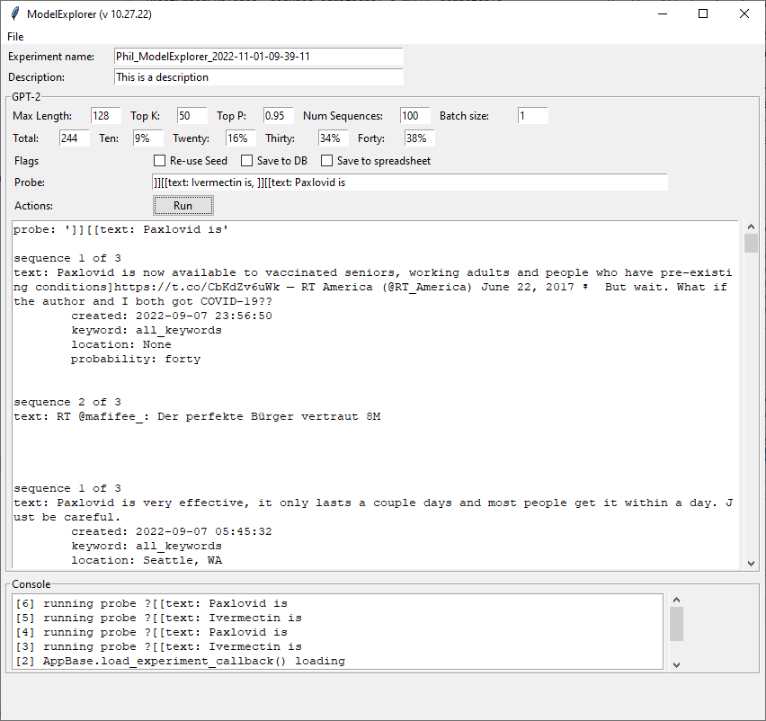

# ModelExplorer

_ModelExplorer_ is a standalone Python application that lets a user interact with a finetuned GPT-2 model trained using EmbeddingExplorer



## Before Starting
_ModelExplorer_ requres a MySQL-compatable database. My favorite is MariaDB, wich comes with the [XAMPP stack](https://www.apachefriends.org/). The code uses the LOCAL_ROOT_MYSQL system variable, which you can set up in Windows by using the [Environment Variables](https://docs.oracle.com/en/database/oracle/machine-learning/oml4r/1.5.1/oread/creating-and-modifying-environment-variables-on-windows.html) control panel as shown below:


The schema for the database is in the **data** directory. The database must be named **gpt_experiments**. The easiest way that I know to create the database is to open a console window in the directory with the sql file, then access the database (e.g. <span style="font-family:Courier;">mysql -u root -pmy_sql_password123</span>). At the sql prompt, type the following

```
MariaDB [(none)]> create database gpt_experiments;
MariaDB [(none)]> use gpt_experiments;
MariaDB [gpt_experiments]> source gpt_experiments_schema.sql;
MariaDB [gpt_experiments]> describe gpt_experiments;
+---------------------------+
| Tables_in_gpt_experiments |
+---------------------------+
| combined                  |
| model_combined            |
| table_experiment          |
| table_output              |
| table_text                |
| table_text_data           |
| test_view                 |
+---------------------------+
7 rows in set (0.001 sec)
```
### GPT-2 Models
_ModelExplorer uses Huggingface GPT-2 models fine-tuned to create tweets wrapped in meta information. The creation of the corpora is described in [**TweetEmbedExplorer**](../markup/TweetEmbedExplorer.md). Biefly, you need to have a test and train file that has text that looks like this: 

        [[text: RT @Andygetout: Sehr geehrter @Karl_Lauterbach,gestern und heute musste ich mit Schrecken feststellen, wie und warum Paxlovid NICHT bei d… || created: 2022-09-04 07:10:25 || location: Kaiserslautern, Germany || probability: twenty]]
        [[text: RT @axios: There's growing concern about the link between Pfizer's antiviral pill and COVID rebound, in which patients test positive or hav… || created: 2022-09-03 02:40:34 || location: Bendigo, Victoria. Australia || probability: thirty]]

To train a model, check out the Huggingface transformers project from GitHub (https://github.com/huggingface/transformers.git). The script you want to execute to train using your corpora is _transformers/examples/pytorch/language-modeling/run_clm,py_

To run the script, you will need your text and train files (below named _all_keywords_train.txt_ and _all_keywords_test.txt_) in the directory with the script and test/train files:

        python .\run_clm.py --model_type=gpt2 --model_name_or_path gpt2 --train_file ./all_keywords_train.txt --validation_file ./all_keywords_test.txt --do_train --do_eval --output_dir ./output --per_device_train_batch_size=1 --block_size 1024 --num_train_epochs 6

Running the script will produce an _output_ folder that will contain the model and the checkpoints:


Inside the output folder, you'll find the files that make up the trained model (highlighted in yellow). 


Copy these files to a folder in your project. You will need to select this folder to run the model from within the App.

At this point the app should be ready to use.

## How to use

Using the tool is pretty straightforward. That being said, it's possible to break it. If you are running it in the console, then you will get additional information on the command line that might help you figure out things. 