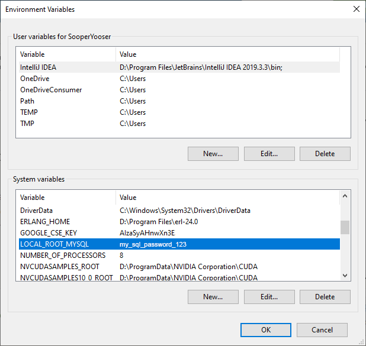

#TweetDownloader

_TweetDownloader_ is a standalone Python application that managed balanced and proportional downloading of tweets based on keywords over a specified time range.


##Before Starting
The app **requires** that you have a Twitter developer account:

See Twitter for how to get an account and bearer token: https://developer.twitter.com/en

See the [**Before Using** in the README](../README.md) for how to set up the app to access the Twitter bearer token.  _TweetDownloader_ requres additional a MySQL-compatable database. My favorite is MariaDB, wich comes with the [XAMPP stack](https://www.apachefriends.org/). The code uses the LOCAL_ROOT_MYSQL system variable, which you can set up in Windows by using the [Environment Variables](https://docs.oracle.com/en/database/oracle/machine-learning/oml4r/1.5.1/oread/creating-and-modifying-environment-variables-on-windows.html) control panel as shown below:



The schema for the database is in the **data** directory. The database must be named **twitter_v2**. The easiest way that I know to create the database is to open a console window in the directory with the sql file, then access the database (e.g. <span style="font-family:Courier;">mysql -u root -pmy_sql_password123</span>). At the sql prompt, type the following

```
MariaDB [(none)]> create database twitter_v2;
MariaDB [(none)]> use twitter_v2;
MariaDB [twitter_v2]> source twitter_v2.sql;
MariaDB [twitter_v2]> describe twitter_v2;
+----------------------+
| Tables_in_twitter_v2 |
+----------------------+
| keyword_tweet_view   |
| table_experiment     |
| table_query          |
| table_tweet          |
+----------------------+
4 rows in set (0.001 sec)
```

At this point the app should be ready to use.

## How to use

Using the tool is pretty straightforward. That being said, it's possible to break it. If you are running it in the console, then you will get additional information on the command line that might help you figure out things. Most often, it is a poorly-formed keyword that gets sent off to Twitter. Also, setting up your twitter account properly is tricky, so make sure that you have that working for counts. See the following:

- https://developer.twitter.com/en/docs/twitter-api/getting-started/getting-access-to-the-twitter-api
- https://developer.twitter.com/en/docs/authentication/guides/v2-authentication-mapping

if you run into trouble.

The screen is divided into 4 panels:
- Experiment name - see description in [KeywordExplorer](../markup/KeywordExplorer.md)
- [Twitter](#twitter-panel)
- [Twitter Params](#twitter-params-panel)
- [Console](#console)

### Twitter <span id="twitter-region"/>
>

This panel is for organizing the retrieval of tweets containing keywords as separate entries in the database. The example query:

> <span style="font-family:Courier;">select name, keyword, text from keyword_tweet_view limit 10;</span>

returns the following in my dataset:

> 

The controls and their functions are described below:

#### Test Keywords
#### Start Date
#### End Date
#### Duration
#### Collect
#### Analytics

### Twitter Params <span id="twitter-params-region"/>
>

#### Sample (10-500)

#### Clamp
#### Percent
#### Options
#### Corpus Size
#### Lowest/Day
#### Highest/Day
#### Cur Date

### Console <span id="console"/>
>

Lorem ipsum
