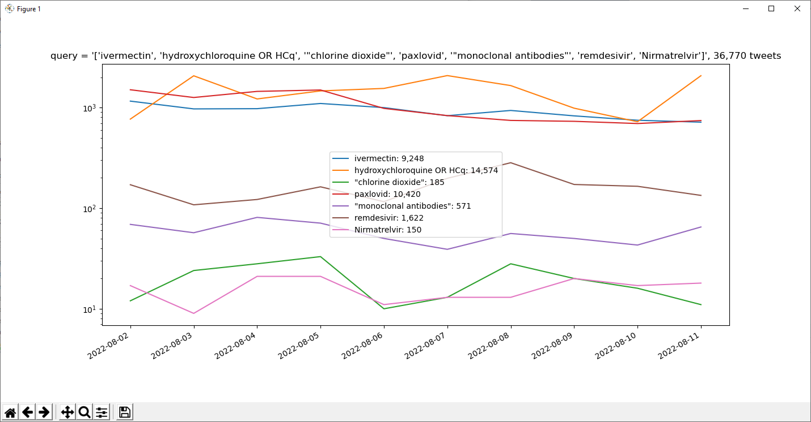

#TweetCountExplorer
_TweetCountExplorer_ is a standalone app that is just the Twitter trends functionality from [_KeywordExplorer_](../markup/KeywordExplorer.md). Below is an example of the running app:

And this is an example of the Twitter results:

## How to use

Using the tool is pretty straightforward. That being said, it's possible to break it. If you are running it in the console, then you will get additional information on the command line that might help you figure out things. Most often, it is a poorly-formed keyword that gets sent off to Twitter. Also, setting up your twitter account properly is tricky, so make sure that you have that working for counts. See

https://developer.twitter.com/en/docs/twitter-api/tweets/counts/introduction

if you run into trouble.

The screen is divided into 4 panels:
- Experiment name - see description in [KeywordExplorer](../markup/KeywordExplorer.md)
- [Twitter](#twitter-panel)
- [Twitter Params](#twitter-params-panel)
- Console - see description in [KeywordExplorer](../markup/KeywordExplorer.md)

### Twitter 
>

This panel lets you explore counts of keywords and hashtags for the period of time that you're interested in. You set your start and end dates in the date fields. You can adjust the sampling rate in the [Twitter Params] panel.

The algorithm for getting keyword counts has two elements - the keyword, and the span of days. Twitter breaks the response into several pieces. Each piece counts as a resuest of the Twitter V2 API, and it only allows so many requests, so don't try to pull in a full year of daily Tweets for a large set of keywords.

Keywords can be edited in the **Test Keyword(s)** window. Using 'OR' allows you to combine keywords. For example, "Hampsters OR Rabbits". They can also be loaded using the **File->Load Experiment** menu. If you make changes to the keywords and you want to save the results, use the **File->Save Experiment** menu. Examples are in the data directory.

Pressing the **Test Keyword** button will send a series of qaueries to Twitter that gets the number of tweets per day over a given time range. It will also open a window with a plot showing the values for each keyword over time. If you close the plot, you can reopen it by clicking **Plot**. Clicking **Save** will open a dialog that lets you save the data in the chart as an excel file.

Running the same query over a range of dates will accumulate the results in the same plot (Known bug - the app treats each new sample as a different label). This allows quickly compare keaywords over a range of dates without blowing through your API limits. To start a new plot, press **Clear** before running.

Lastly, clicking **Launch Twitter** will open a set of tabs in your default browser - one for each keyword within the range of dates specified. This allows you to quickly explore keywords in context. For example, you could see if the "Birds" keywords referred to [the group of warm-blooded vertebrates constituting the class Aves](https://en.wikipedia.org/wiki/Bird), or the [Baltimore Orioles](https://en.wikipedia.org/wiki/Baltimore_Orioles) if you were looking at dates that included games during their 2014 season.

### Twitter Params 
>

If your request spans too much time, you can subsample across weeks or months. Unlike the "day" option, these are not complete counts. Instead they subsample a week or month (Hey [@TwitterDev](https://twitter.com/TwitterDev)! Could you add these as options?). As such they are not accurate counts, but are still good for determining realative trends between keywords.